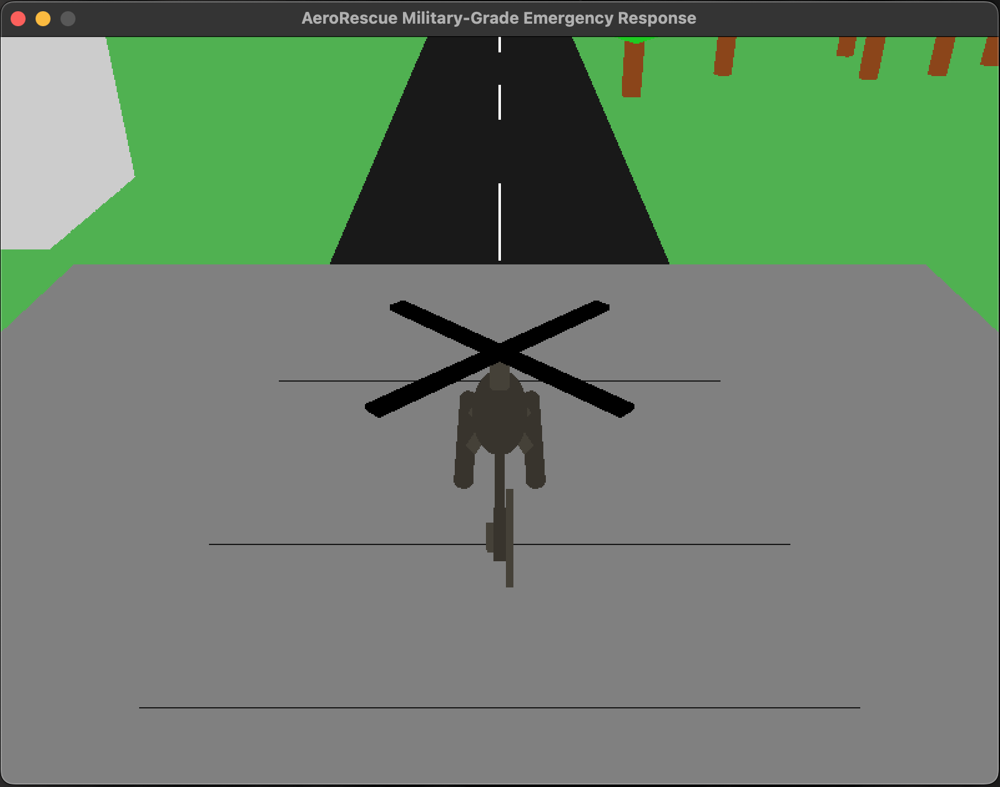
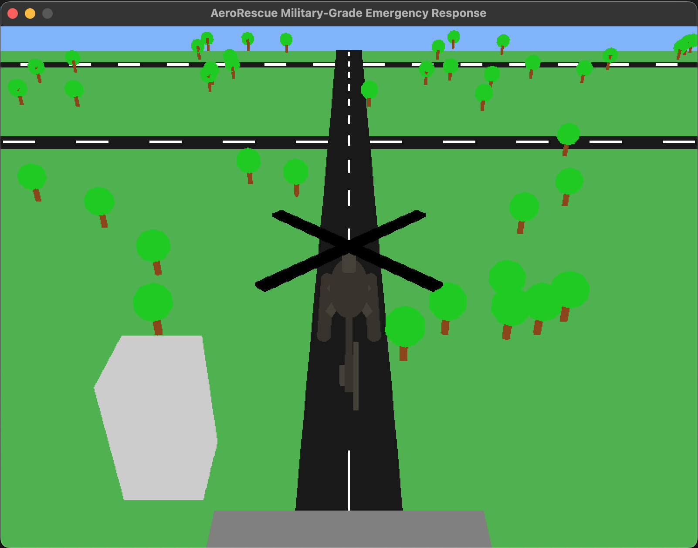
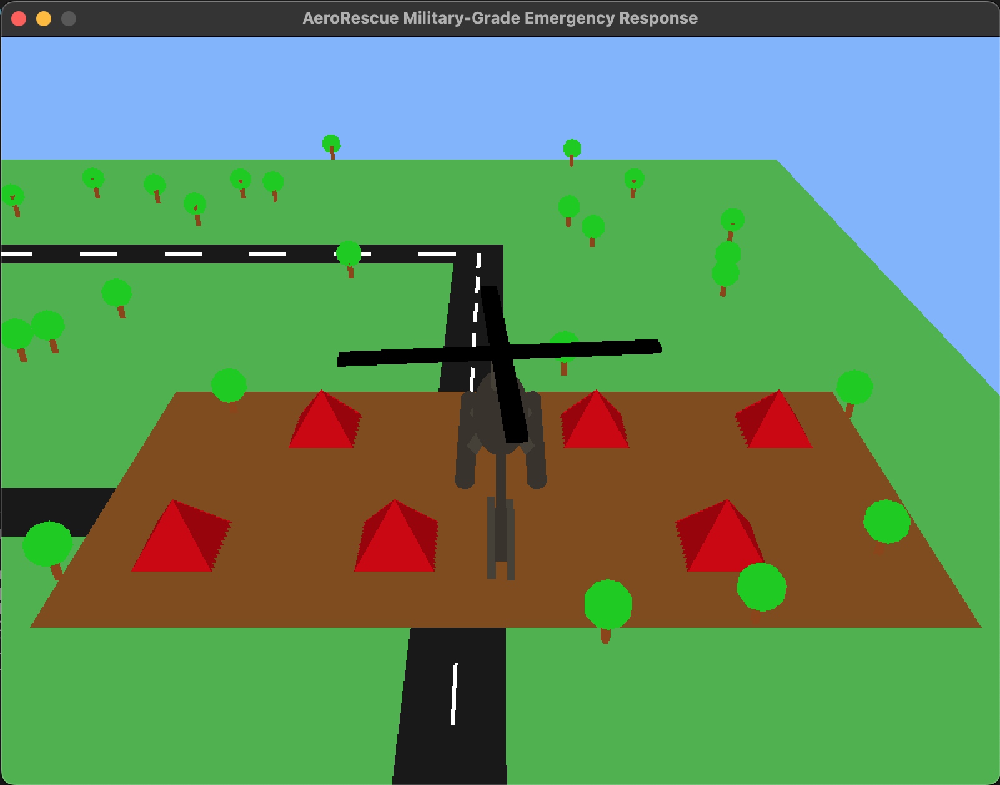
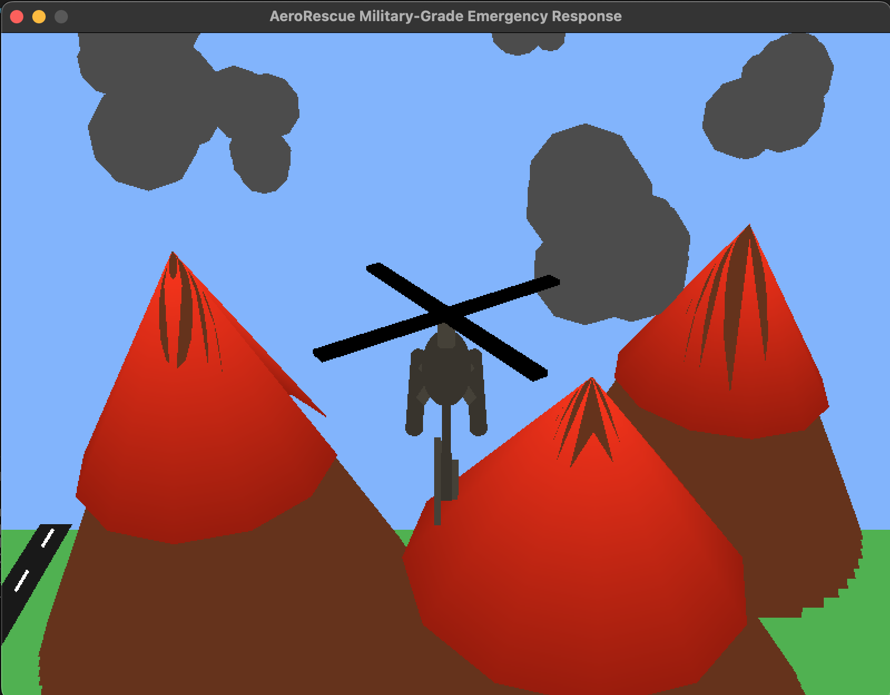

# AeroRescue Military-Grade Emergency Response
_Military helicopter rescue operation simulation in a volcanic disaster scenario._

## 📌 Overview
AeroRescue Military-Grade Emergency Response is a simulation of a military helicopter rescue operation tasked with evacuating victims from disaster areas. The simulation includes various environmental elements such as a military base, evacuation routes, erupting volcanoes, and a refugee camp serving as a safe zone for evacuees.

Users can control the helicopter for takeoff, landing, and navigation in multiple directions using keyboard controls. The applied animations include rotating propellers, engine sound effects, and dynamic environmental changes.

## ✨ Features
- **Helicopter Control**: Users can control the helicopter for takeoff, landing, and movement in multiple directions.
- **Realistic Animation Effects**: Dynamic propeller rotation based on engine status.
- **Erupting Volcano**: Lava and smoke emerge from the crater, creating an emergency scenario.
- **Environmental Simulation**: Includes a military base, evacuation routes, a refugee camp, and trees.
- **Engine Sound Effects**: Engine sound changes based on the helicopter’s status.

## 🖥️ Requirements
- Python 3.x
- OpenGL (PyOpenGL)
- Pygame

## ⚙️ Installation
1. **Clone the repository**
```sh
 git clone https://github.com/Erlemico/AeroRescue-Simulation.git
 cd AeroRescue-Simulation
```
2. **Install dependencies**
```sh
 pip3 install -r requirements.txt
```
3. **Run the simulation**
```sh
 python3 main.py
```

## 🎮 Controls
| Key | Action |
|------|--------|
| `O` | Turn on/off the engine |
| `Q` | Takeoff |
| `E` | Land |
| `W` | Move forward |
| `S` | Move backward |
| `A` | Move left |
| `D` | Move right |
| `LEFT` | Rotate left |
| `RIGHT` | Rotate right |
| `UP` | Rotate forward |
| `DOWN` | Rotate backward |

## 📁 Project Structure
```
AeroRescue-Simulation/
│── assets/                   # Folder for textures and sounds
│   │── sounds/                 # Folder for sounds
│   │   │── idle-engine.mp3             # Sound for idle engine
│   │   │── landing-engine.mp3          # Sound for landing engine
│   │   │── start-engine.mp3            # Sound for start engine
│   │   │── stop-engine.mp3             # Sound for stop engine
│   │   │── takeoff-engine.mp3          # Sound for takeoff engine
│   │── textures/               # Folder for textures
│   │   │── army.jpg                    # Texture for helicopter
│── components/
│   │── camera.py             # Manages camera movement
│   │── environment.py        # Manages environment elements like bases, volcanoes, etc.
│   │── helicopter.py         # Draws the helicopter and its propellers
│── main.py                   # Main program handling input and rendering
│── requirements.txt          # List of dependencies
│── README.md                 # Documentation for this project
```

## 🛠️ Technologies Used
- **Python**
- **PyOpenGL**
- **Pygame**

## 📸 Screenshots
**Heli Base Area**


**Helicopter Rescue**


**Refugee Camp**


**Volcanoes**


## 🎥 Simulation
[](https://youtu.be/CZYDLnaDKHM)

## 📜 License
This project is licensed under the MIT License.

## 👨‍💻 Contributors
- **Moammar Saddam**
- **Muhammad Abiyasha Sergio**
- **Andromeda Triasta Veliano Hindrayana**
- **Moqtada Aziz Pratama**

If you have suggestions or want to contribute, feel free to create a _pull request_ or open an _issue_ in this repository! 🚁🔥
